# AWS-Cloud-Environment-Setup-Account-Creation-Free-Tier-Access

<h2>Description</h2>
Amazon Web Services (AWS) is a platform that gives you access to computing tools like servers (EC2), storage (S3), databases, and more, without needing to “build the house” yourself. You only pay for what you use. Most people (especially students or learners) start with the free tier, which gives you enough resources to learn and build basic projects without being charged. And that’s what you’ll learn how to set up here.
<br />

## Easy Step-by-Step Guide to Create an AWS Free Tier Account

### **Step 1: Visit the AWS Website**

1. Open your web browser and search for aws free tier.

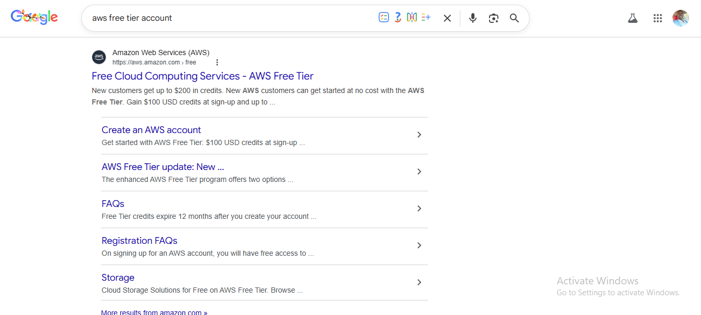

2. Click on [**https://aws.amazon.com](https://aws.amazon.com/)/free**.
3. Click **“Create a free Account”** at the top right corner.

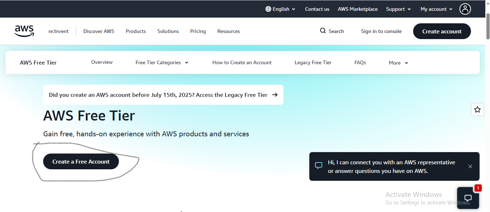

---

### **Step 2: Enter Your Email and Account Name**

1. Enter a **valid email address** (this will be your AWS root account email).
2. Choose an **AWS account name** (e.g., *My First AWS Account*).
3. Click **Verify email address**.

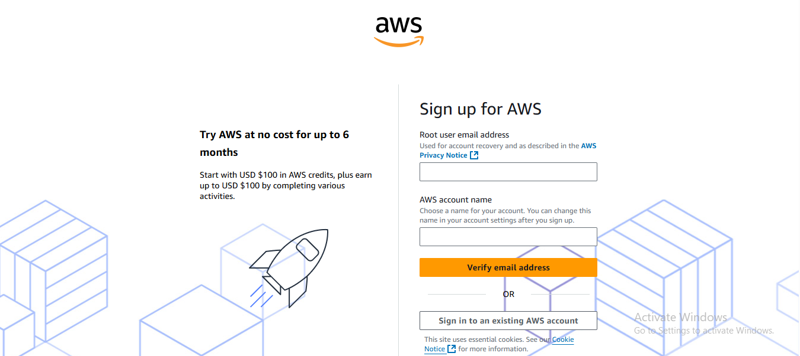

---

4. Type security verification
5. Check Your email and input a verification code sent by aws

### **Step 3: Create a Password**

1. Create a **strong password** (mix of letters, numbers, and symbols).
2. Re-enter the password to confirm.
3. Click **Continue**.

### **Step 4: Choose a Plan**

1. Choose a **plan**.
2. Click on **Choose free plan**.

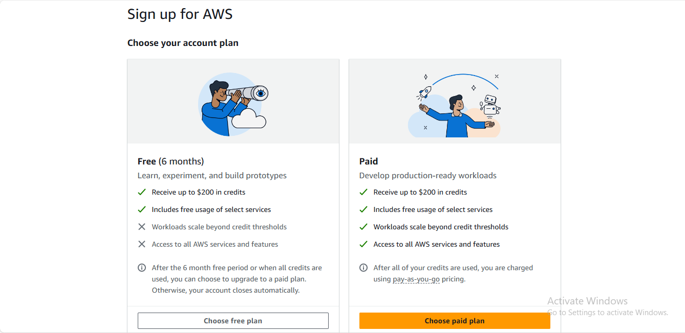

---

### **Step 4: Enter Contact Information**

1. Select **Personal** (recommended for Free Tier users).
2. choose how you plan to use AWS
3. Fill in:
    - Full name
    - Phone number
    - Country/Region
    - Address
4. Read and accept the **AWS Customer Agreement**.
5. Click **Agree and Continue**.


---

### **Step 5: Add Payment Information**

1. Enter your **debit or credit card details**.
    - AWS requires this for identity verification.
    - You will **not be charged** if you stay within Free Tier limits.
2. Click **Verify and Continue**.

> 💡 AWS may temporarily deduct a very small amount (usually refunded).
> 

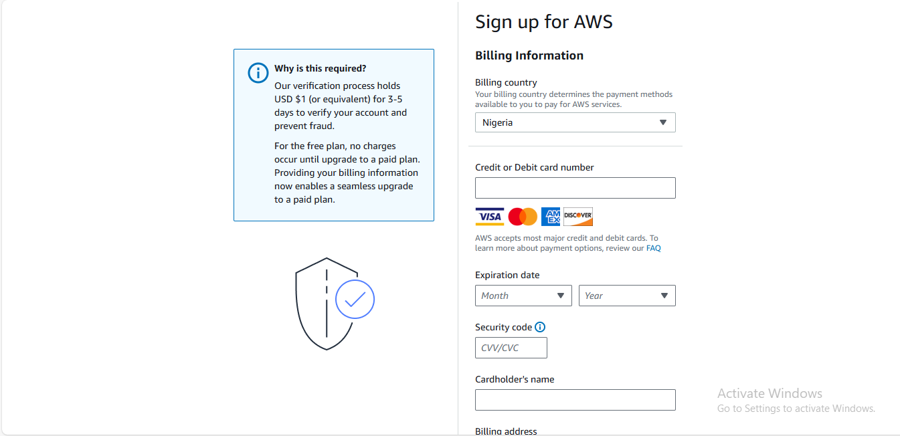

---

### **Step 6: Verify Your Phone Number**

1. Enter your **phone number**.
2. Choose to receive a **verification code** by SMS or voice call.
3. Click send SMS
4. Enter the code when prompted.
5. Click **Continue**.
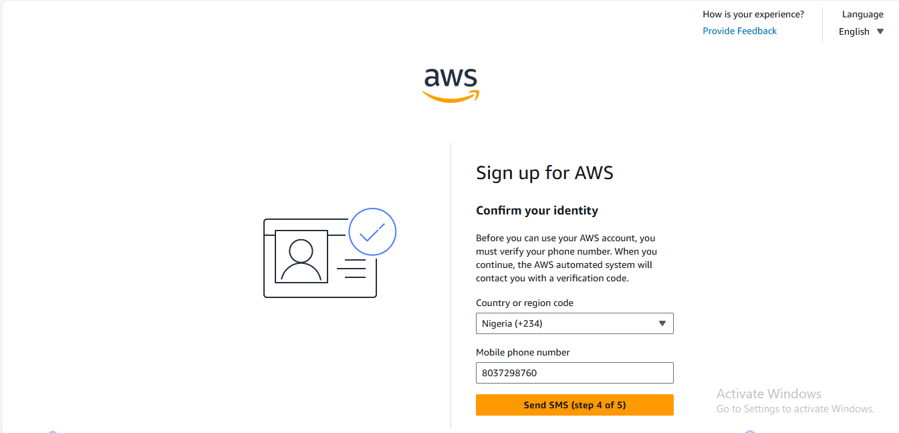

---

**Account Succesful**

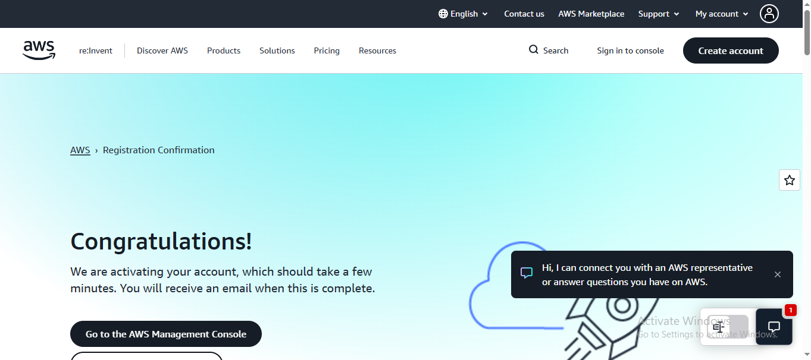

# **HOW To** Implement Multi-Factor Authentication (MFA) **In AWS**

## 1. Project Overview

---

This project documents the step-by-step process of setting up **Multi-Factor Authentication (MFA)** in Amazon Web Services (AWS) to improve account security. MFA adds an extra layer of protection by requiring a second verification method in addition to a password.

This project covers:

- Enabling MFA for the **root user**
- Enabling MFA for **IAM users**
- Verifying MFA functionality
- Security best practices

---

## 2. Project Objectives

- Understand the importance of MFA in AWS
- Secure AWS accounts against unauthorized access
- Configure virtual MFA devices
- Apply AWS security best practices

---

## 3. Tools & Requirements

Before starting, ensure you have the following:

- An active **AWS account**
- Access to **AWS Management Console**
- A smartphone or computer with an authenticator app:
    - Google Authenticator
    - Microsoft Authenticator
    - Authy

---

## 4. What is MFA in AWS?

Multi-Factor Authentication (MFA) requires users to provide:

1. **Something they know** – Password
2. **Something they have** – Temporary code from an authenticator app or hardware device

AWS supports:

- Virtual MFA devices
- Hardware MFA devices
- FIDO2 security keys (advanced use)

---

## 5. Step 1: Enable MFA for AWS Root User (Highly Recommended)

### Why This Is Important

The root user has **full control** over the AWS account. It must always be protected with MFA.

### Steps

1. Sign in to AWS using the **root email address**
2. Open the **AWS Management Console**
3. Click your **account name** (top right corner)
4. Select **Security credentials**
5. Under **Multi-factor authentication (MFA)**, click **Assign MFA device**
6. Choose **Virtual MFA device**
7. Click **Continue**
8. Open your authenticator app
9. Scan the **QR code**
10. Enter two consecutive MFA codes from the app
11. Click **Assign MFA**

✅ **Result:** Root account MFA enabled successfully

OR

1. Sign in to AWS using the **root email address**
2. Open the **AWS Management Console**
3. Search for IAM and open it
4. On IAM Dashboard click on Add MFA Button
    
    

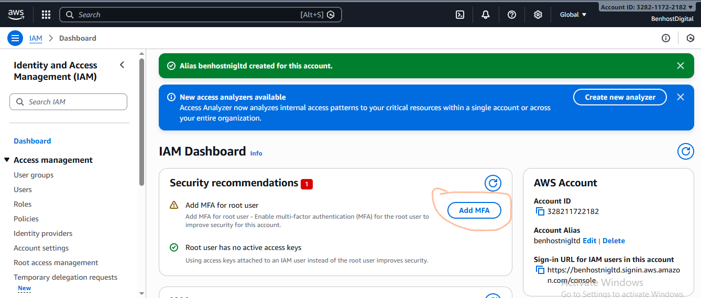

---

1. Type the device name of your choice
2. Select a mfa device selection (Google Authenticator Recomended)

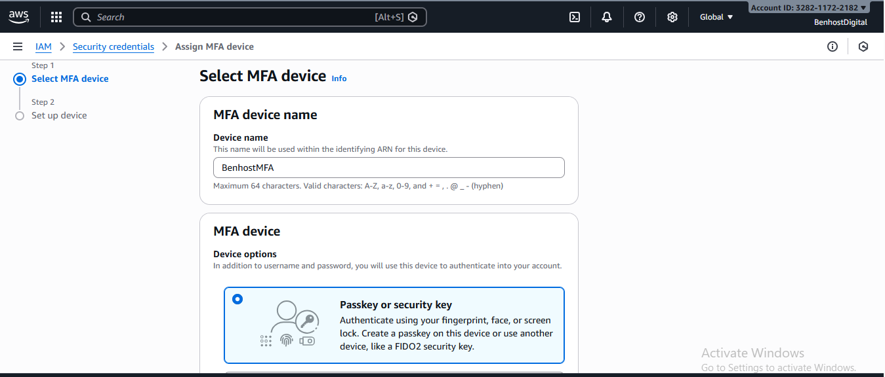

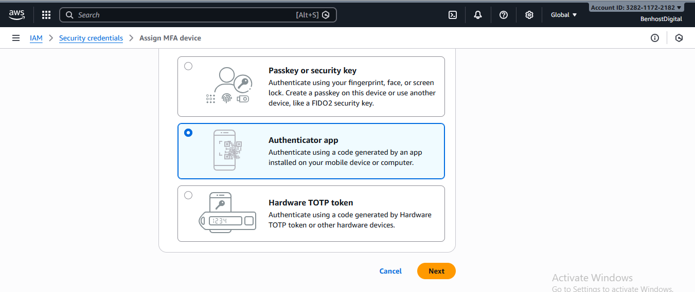

1. Click Next 
2. Setup device for your Authenticator by clicking on show key. Then use your phone to set it up.

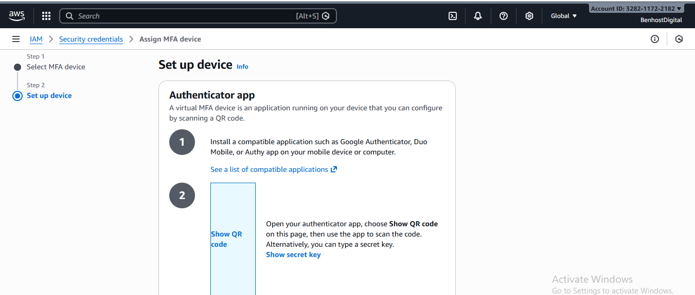

## 6. Step 2: Enable MFA for an IAM User

### Steps

1. Log in to AWS as an **administrator**
2. Navigate to **IAM**
3. Click **Users**
4. Select the IAM user

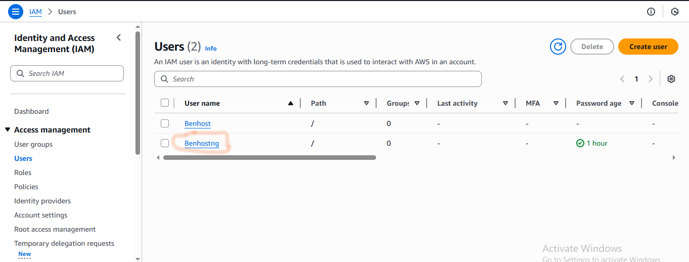

1. Open the **Security credentials** tab
2. Under **Multi-factor authentication (MFA)**, click **Assign MFA device**
3. Choose **Virtual MFA device**
4. Click **Next**

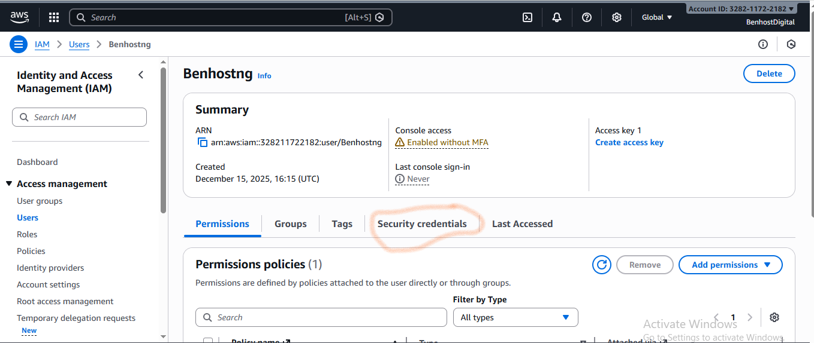

1. Scan QR code with authenticator app
2. Enter two MFA codes
3. Click **Assign MFA**

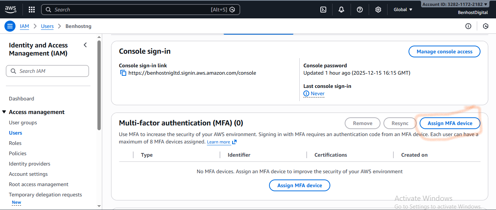

✅ **Result:** IAM user MFA enabled

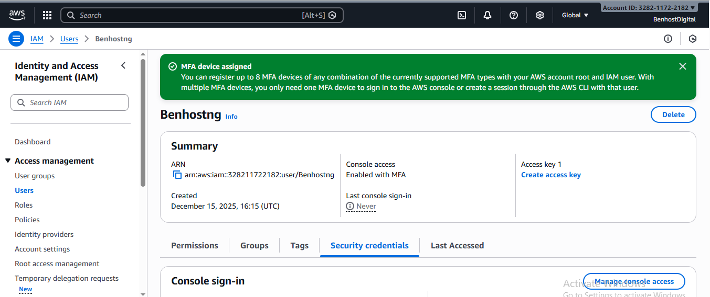

---

## 7. Step 3: Test MFA Login

### Steps

1. Log out of AWS
2. Log in again using:
    - Username
    - Password
    - MFA code from authenticator app
3. Confirm successful login

✅ **Verification Complete**

---

## 8. Step 4: Enforce MFA Using IAM Policy (Optional but Recommended)

This step ensures users **must** use MFA before accessing AWS resources.

### Example IAM Policy (MFA Enforcement)

```json
{
  "Version": "2025-12-17",
  "Statement": [
    {
      "Effect": "Deny",
      "Action": "*",
      "Resource": "*",
      "Condition": {
        "BoolIfExists": {
          "aws:MultiFactorAuthPresent": "false"
        }
      }
    }
  ]
}

```

### How to Apply

1. Go to **IAM**
2. Click **Policies**
3. Create a new policy
4. Paste the JSON policy
5. Attach it to IAM users or groups

---

## 9. Security Best Practices

- ✅ Always enable MFA for root user
- ✅ Enforce MFA for all IAM users
- ❌ Never use root account for daily tasks
- 🔐 Rotate passwords regularly
- 📜 Monitor login activity using CloudTrail

---

## 10. Project Status

- [x]  Root user MFA enabled
- [x]  IAM user MFA enabled
- [x]  MFA tested
- [x]  Policy enforcement documented

---

## 12. Conclusion

Implementing MFA is a critical security measure in AWS. This project demonstrates how MFA can be easily configured and enforced to protect cloud infrastructure and user identities.

---

# **AWS IAM (USER, USER GROUP, ROLE, POLICIES IDENTITY PROVIDER)**

AWS Identity and Access Management (IAM) is a web service for securely controlling access to AWS services. With IAM, you can centrally manage users, security credentials such as access keys, and permissions that control which AWS resources users and applications can access.

## **Prerequisites**

- An **AWS account** (Free Tier is fine)
- Access to the **AWS Management Console**
- Logged in as the **Root user** or an IAM user with **AdministratorAccess**

---

## **1. How to Create an IAM User**

IAM users represent **people or applications** that need access to AWS.

### **Steps**

1. Sign in to **AWS Management Console**
2. Search for **IAM** and open it

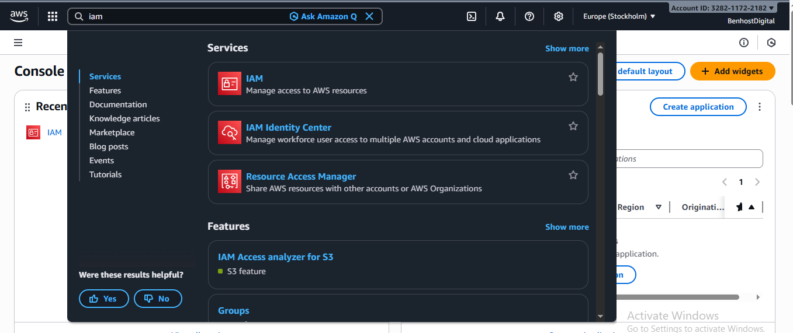

1. Click **Users** (left menu)

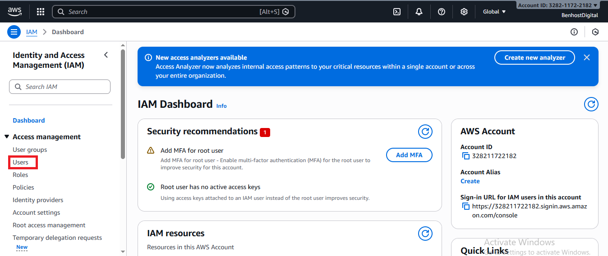

1. Click **Create user**

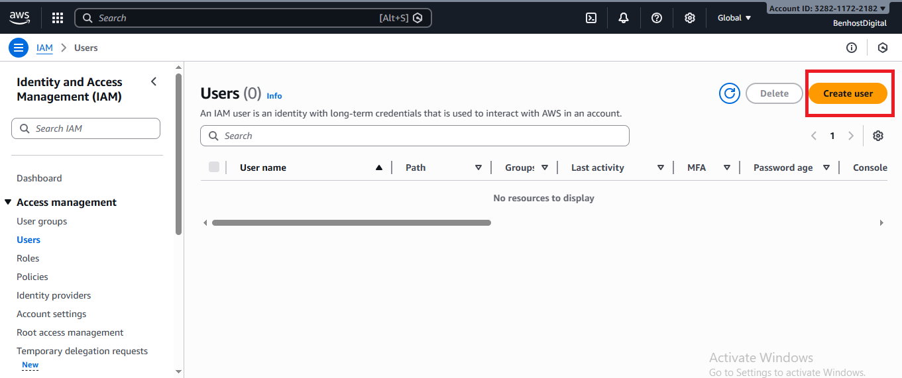

1. Enter a **User name** (e.g., `dev-user`)
2. Select access type:
    - ✔️ **AWS Management Console access** (for humans)
    - ✔️ **Programmatic access** (for CLI/API)
3. Set password:
    - Auto-generated or custom
    - Choose **User must create a new password at next sign-in**
4. Click **Next**

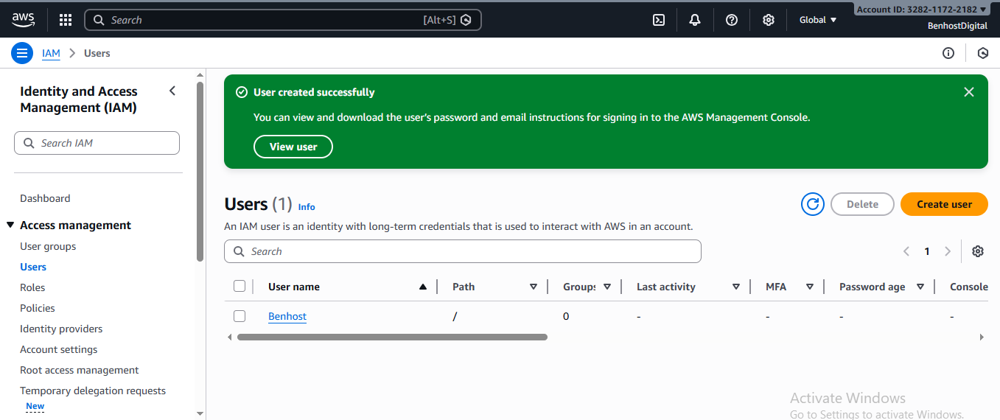

---

## **2. How to Create IAM User Groups**

Groups help manage permissions for **multiple users at once**.

### **Steps**

1. In IAM Dashboard → click **User groups**
2. Click **Create group**

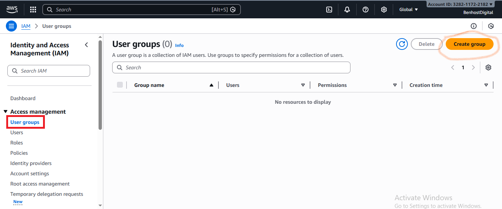

1. Enter **Group name** (e.g., `Developers`)
2. Attach policies:
    - Example: `AmazonEC2ReadOnlyAccess`
    - Or `AdministratorAccess` (not recommended for production)
3. Click **Create group**

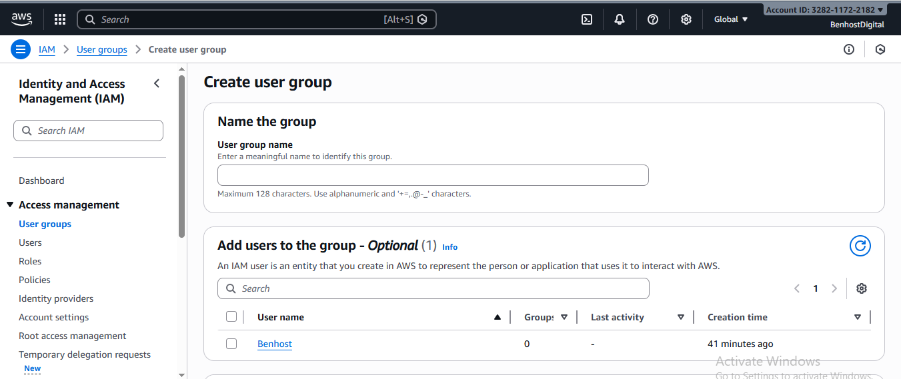

1. Add users to the group (optional)

✅ **Best Practice:** Always assign permissions via groups, not directly to users.

---

## **3. How to Attach User to a Group**

1. Open **IAM → Users**
2. Click the user name
3. Go to **Groups tab**
4. Click **Add user to groups**
5. Select the group
6. Click **Add**

[]()

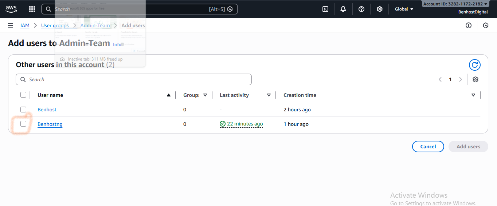

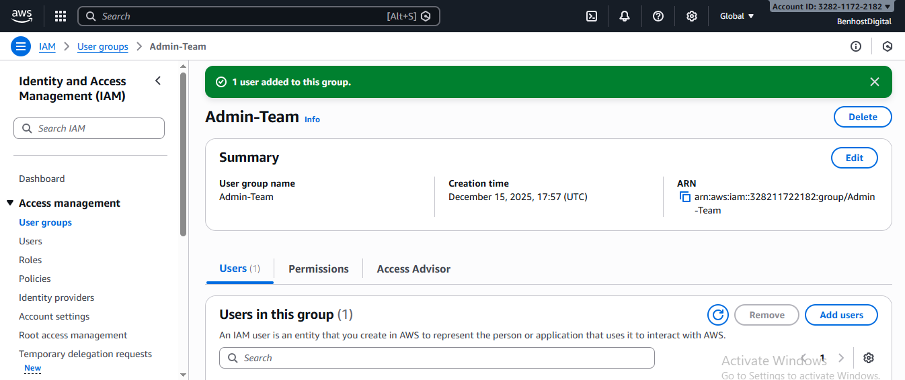

---

## **4. How to Create IAM Policies**

Policies define **what actions are allowed or denied**.

### **Steps (Using Visual Editor – Beginner Friendly)**

1. Go to **IAM → Policies**
2. Click **Create policy**

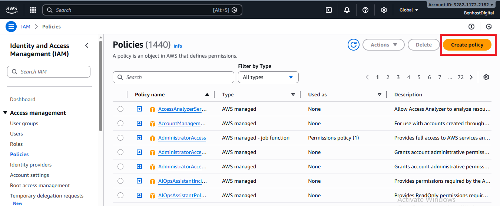

1. Choose **Visual editor**
2. Select a **Service** (e.g., EC2)
3. Choose **Actions** (e.g., Start, Stop, Describe)
4. Choose **Resources** (All or specific)
5. Click **Next**

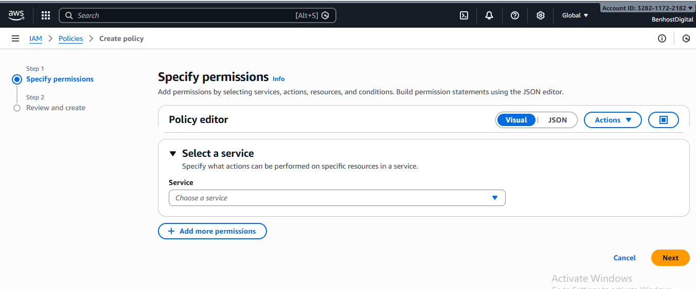

1. Give policy a **Name** (e.g., `EC2StartStopPolicy`)
2. Click **Create policy**

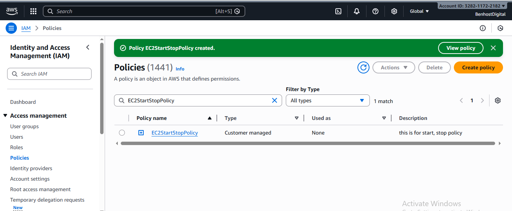

---

### **Steps (Using JSON – Advanced)**

```json
{
  "Version": "2012-10-17",
  "Statement": [
    {
      "Effect": "Allow",
      "Action": [
        "ec2:StartInstances",
        "ec2:StopInstances"
      ],
      "Resource": "*"
    }
  ]
}

```

---

## **5. How to Attach IAM Policy**

You can attach policies to:

- Users
- Groups
- Roles

### **Steps**

1. Open **User / Group / Role**
2. Click **Add permissions**
3. Choose **Attach policies**
4. Select policy
5. Click **Add permissions**

---

## **6. How to Create IAM Roles**

Roles are used by **AWS services or external identities**.

### **Steps**

1. Go to **IAM → Roles**
2. Click **Create role**

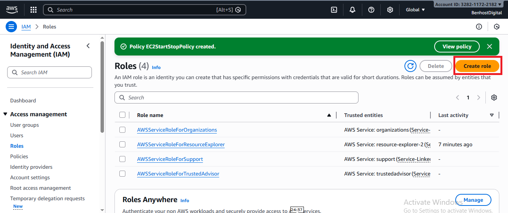

1. Select **Trusted entity type**:
    - AWS service (e.g., EC2, Lambda)
    - Another AWS account
    - Web identity

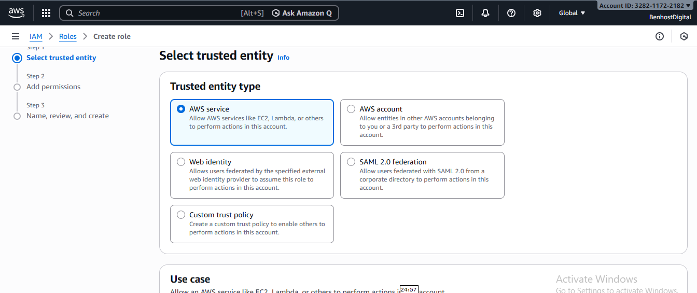

1. Choose the service (e.g., EC2)
2. Attach permissions policy
3. Enter **Role name** (e.g., `EC2-S3-Access-Role`)
4. Click **Create role**

✅ **Example:** Allow EC2 to access S3 without storing credentials.

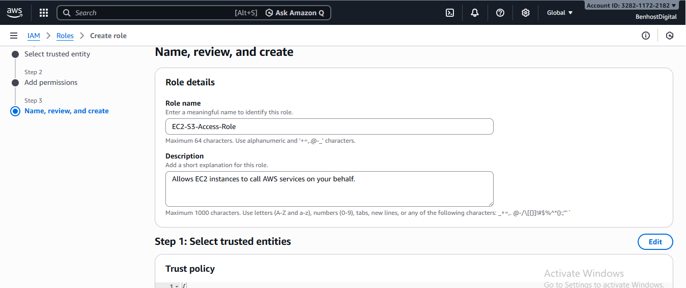

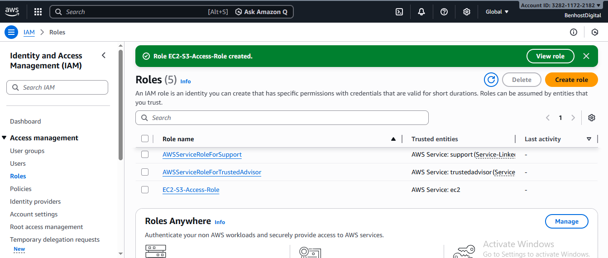

---

## **7. How to Assign Role to an EC2 Instance**

1. Open **EC2 Dashboard**
2. Select instance
3. Click **Actions → Security → Modify IAM role**
4. Select role
5. Click **Update IAM role**

---

## **8. Best Practices (Very Important)**

---

✔️ Never use the **root account** for daily work

✔️ Enable **MFA** on root and IAM users

✔️ Use **IAM roles instead of access keys** where possible

✔️ Apply **least privilege principle**

✔️ Rotate access keys regularly

✔️ Use **groups for permissions**

---

## **9. Summary Table**

| IAM Component | Purpose |
| --- | --- |
| IAM User | Individual person/app |
| IAM Group | Permission management |
| IAM Policy | Permission rules |
| IAM Role | Temporary access |
| Identity Provider | External authentication |

# AWS ORGANIZATIONS

## Step-by-Step Guide: Creating an AWS Organization, Creating Accounts, and Inviting Existing Accounts

---

## 1. What is AWS Organizations?

AWS Organizations is a service that helps you **centrally manage multiple AWS accounts**. It allows you to:

- Create and manage multiple AWS accounts
- Apply security policies across accounts
- Consolidate billing
- Organize accounts into Organizational Units (OUs)

---

## 2. Prerequisites

Before starting, ensure:

- You have an **AWS root account** or an IAM user with **OrganizationsFullAccess**
- You are logged into the **management (payer) account**
- You have valid email addresses for new AWS accounts
- You know the AWS account IDs or emails of existing accounts to invite

---

## 3. Step 1: Create an AWS Organization

1. Sign in to the **AWS Management Console**
2. In the search bar, type **Organizations**
3. Click **AWS Organizations**
4. Click **Create an organization**

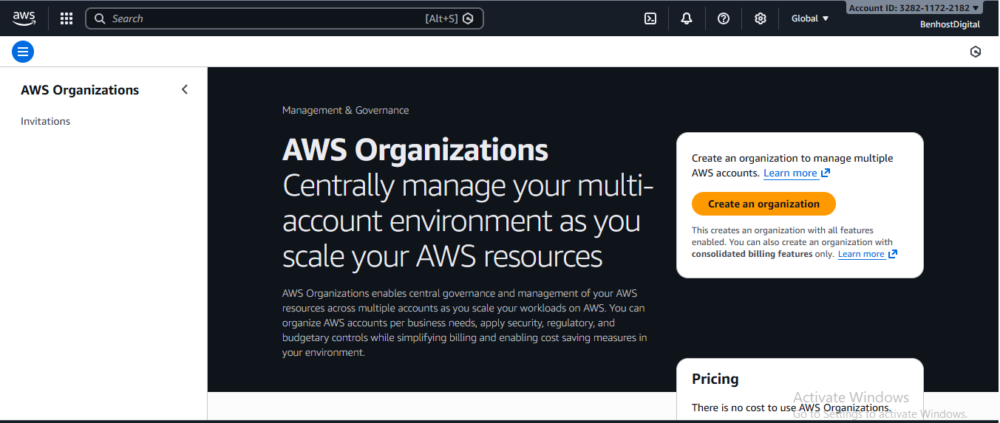

1. Choose **Enable all features** (recommended for full control)
2. Click **Create organization**

✅ Your AWS Organization is now created

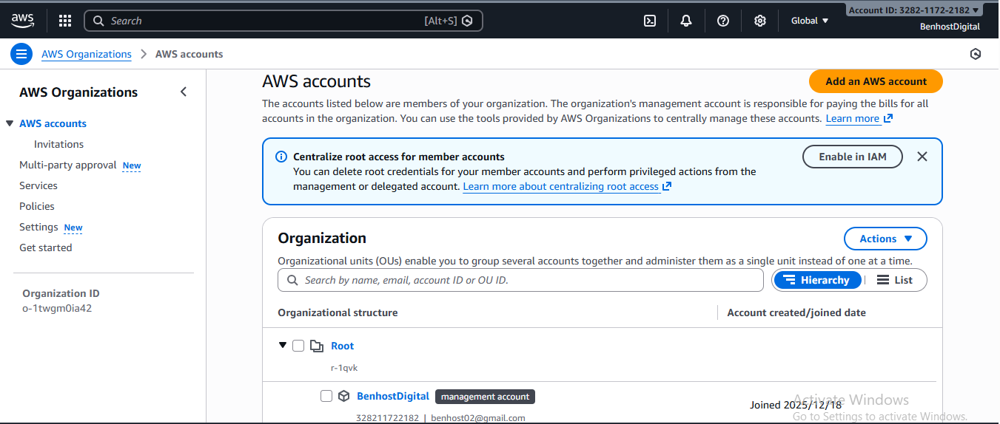

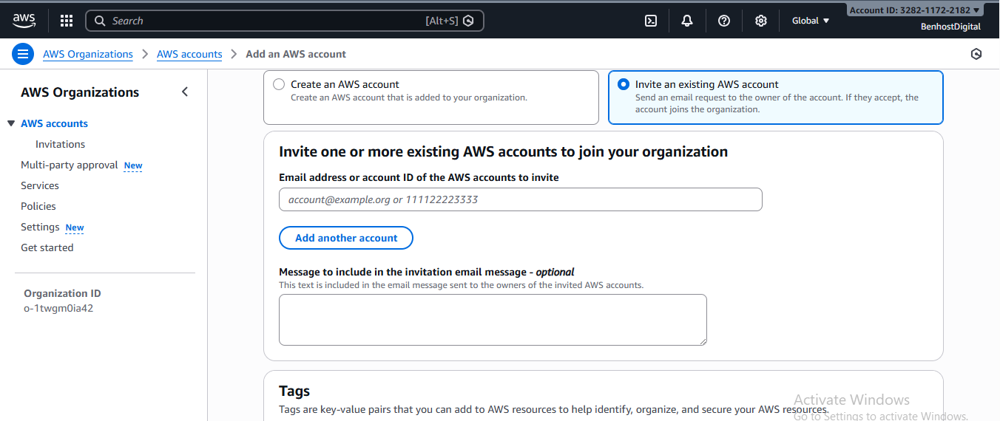

✅ Your current account becomes the **Management Account**

---

## 4. Step 2: Understand the Organization Structure

An AWS Organization consists of:

- **Root** – Top-level container (do not apply policies directly here)
- **Organizational Units (OUs)** – Logical groups of accounts (e.g., Dev, Prod, Security)
- **Accounts** – Individual AWS accounts
- **Service Control Policies (SCPs)** – Permission guardrails

---

## 5. Step 3: Create Organizational Units (Optional but Recommended)

1. In AWS Organizations console
2. Click **Organize accounts**
3. Select **Root**
4. Click **Create organizational unit**
5. Enter OU name (e.g., `Development`, `Production`, `Security`)
6. Click **Create organizational unit**

Repeat for additional OUs as needed.

---

## 6. Step 4: Create a New AWS Account from AWS Organization

1. In **AWS Organizations**
2. Click **Accounts**
3. Click **Add an AWS account**
4. Select **Create an AWS account**
5. Fill in:
    - **Account name**
    - **Email address** (must be unique)
    - **IAM role name** (default is `OrganizationAccountAccessRole`)
6. Choose the **Organizational Unit** to place the account
7. Click **Create AWS account**

⏳ Account creation may take a few minutes

✅ New account will automatically join your organization

---

## 7. Step 5: Access the Newly Created AWS Account

1. Go to **AWS Organizations → Accounts**
2. Select the new account
3. Click **Access**
4. Choose **Switch role**
5. Use the role:
    
    `OrganizationAccountAccessRole`
    

You now have administrative access to the new account.

---

## 8. Step 6: Invite an Existing AWS Account to the Organization

Use this method when the account already exists.

### Option A: Invite by Account ID

1. Go to **AWS Organizations**
2. Click **Accounts**
3. Click **Add an AWS account**
4. Select **Invite an existing AWS account**
5. Enter the **AWS Account ID**
6. Click **Send invitation**

---

### Option B: Invite by Email Address

1. Go to **AWS Organizations**
2. Click **Accounts**
3. Click **Add an AWS account**
4. Select **Invite an existing AWS account**
5. Enter the **email address** associated with the AWS account
6. Click **Send invitation**

---

## 9. Step 7: Accept the AWS Organization Invitation

This step is done by the invited account owner.

1. Log in to the **invited AWS account**
2. Open **AWS Organizations**
3. Click **View invitation**
4. Review the invitation details
5. Click **Accept invitation**

✅ The account is now part of the AWS Organization

---

## 10. Step 8: Move Accounts into Organizational Units

1. In **AWS Organizations**
2. Click **Organize accounts**
3. Select the account
4. Choose **Move**
5. Select the target **Organizational Unit**
6. Click **Move account**

---

## 11. Best Practices

- ✅ Enable **AWS CloudTrail** organization-wide
- ✅ Use **Service Control Policies (SCPs)** for security guardrails
- ✅ Separate accounts by environment (Dev, Test, Prod)
- ✅ Keep the Management Account for billing and governance only
- ❌ Do not run workloads in the Management Account

---

## 12. Common Use Case Structure Example

```
Root
│
├── Security OU
│   ├── Log Archive Account
│   └── Security Tooling Account
│
├── Development OU
│   ├── Dev Account
│
├── Production OU
│   ├── Prod Account
│
└── Sandbox OU
    └── Sandbox Account

```

---

## 13. Benefits

With AWS Organizations, you can:

- Create and manage multiple AWS accounts centrally
- Invite existing AWS accounts
- Apply policies and governance at scale
- Simplify billing and security management

## **AWS Identity Center (SSO) Setup Guide**

## 1️⃣ Project Overview

AWS Identity Center allows you to centrally manage **users**, **groups**, and **access permissions** across multiple AWS accounts and applications. It simplifies authentication using **Single Sign-On (SSO)** and integrates with external identity providers such as Active Directory, Azure AD, or Google Workspace.

This project documents the **step-by-step process** of setting up AWS Identity Center in a secure and organized way.

---

## 2️⃣ Prerequisites

Before starting, ensure the following:

- An **AWS account** (preferably a Management Account in AWS Organizations)
- Administrator access to the AWS account
- Valid email address
- AWS Organization already created (recommended)
- Modern web browser (Chrome, Edge, Firefox)

---

## 3️⃣ Enable AWS Identity Center

### Step 1: Sign in to AWS Console

1. Go to 👉 [https://aws.amazon.com](https://aws.amazon.com/)
2. Click **Sign in to the Console**
3. Log in using the **Root user** or an **Admin IAM user**

---

### Step 2: Open AWS Identity Center

1. In the AWS Console, search for **IAM Identity Center**
2. Click **IAM Identity Center**
3. If not enabled, you will see an **Enable** button

---

### Step 3: Enable Identity Center

1. Click **Enable**
2. AWS will automatically:
    - Create the Identity Center instance
    - Connect it to AWS Organizations
    - Prepare default permission structures

✅ This may take a few seconds.

---

## 4️⃣ Choose Identity Source

### Step 4: Select Identity Source

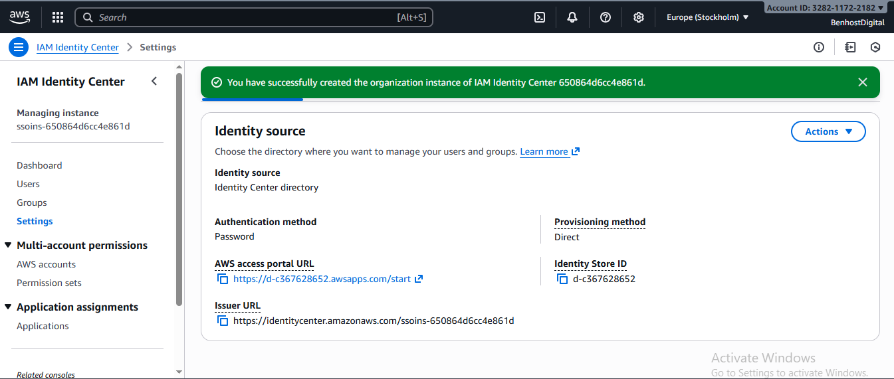

1. Inside IAM Identity Center, click **Settings**
2. Under **Identity source**, choose one of the following:
    - **Identity Center directory (default)** — Recommended for beginners
    - Active Directory
    - External Identity Provider (SAML 2.0)

👉 For this project, select **Identity Center directory**

---

## 5️⃣ Create Users

### Step 5: Create a User

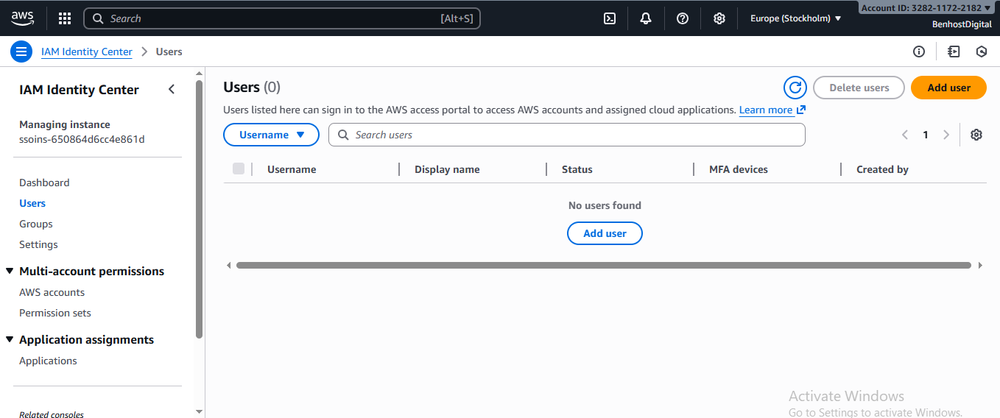

1. Go to **Users**
2. Click **Add user**
3. Fill in:
    - Username
    - Email address
    - First & last name
4. Click **Next**
5. Review details
6. Click **Add user**

📧 The user receives an email to set their password.

---

## 6️⃣ Create Groups

### Step 6: Create a Group

1. Go to **Groups**
2. Click **Create group**
3. Enter:
    - Group name (e.g., `Admins`, `Developers`, `Auditors`)
4. Click **Create group**

---

### Step 7: Add Users to Group

1. Open the group
2. Click **Add users**
3. Select users
4. Click **Add users**

---

## 7️⃣ Create Permission Sets

Permission Sets define **what users can do** in AWS accounts.

### Step 8: Create Permission Set

1. Go to **Permission sets**
2. Click **Create permission set**
3. Choose permission type:
    - AWS managed policy (recommended)
    - Custom policy
4. Examples:
    - `AdministratorAccess`
    - `PowerUserAccess`
    - `ReadOnlyAccess`
5. Set:
    - Session duration (e.g., 1–8 hours)
6. Click **Create**

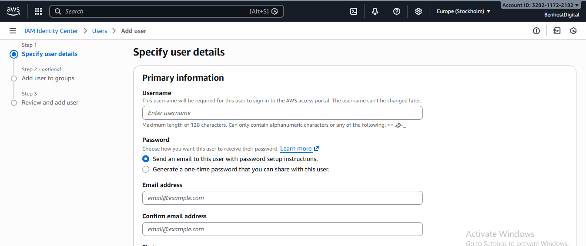

---

## 8️⃣ Assign Access to AWS Accounts

### Step 9: Assign User/Group to AWS Account

1. Go to **AWS accounts**
2. Select an AWS account
3. Click **Assign users or groups**
4. Select:
    - User or Group
    - Permission set
5. Click **Submit**

---

## 9️⃣ Access AWS Using Identity Center

### Step 10: User Login

1. User opens the **AWS access portal URL**
    - Found in **Identity Center dashboard**
2. User logs in using email & password
3. Select assigned AWS account
4. Choose role
5. Access AWS Console securely 🎉

---

## 🔐 Security Best Practices

- Enable **MFA** for Identity Center users
- Assign permissions using **groups**, not individual users
- Use **least privilege access**
- Audit access using **AWS CloudTrail**
- Remove unused users and permissions regularly

---

---

<!--
 ```diff
- text in red
+ text in green
! text in orange
# text in gray
@@ text in purple (and bold)@@
```
--!>
